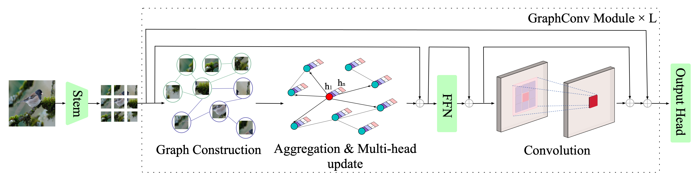
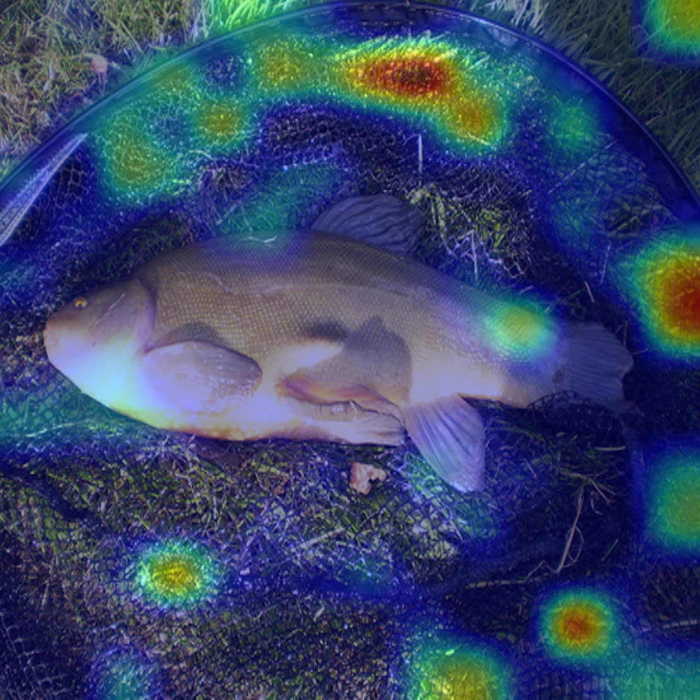
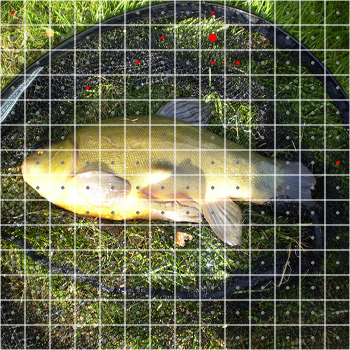
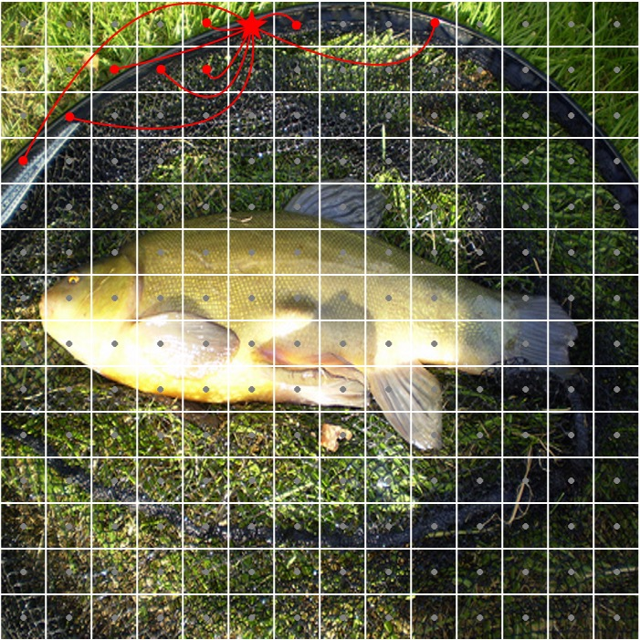
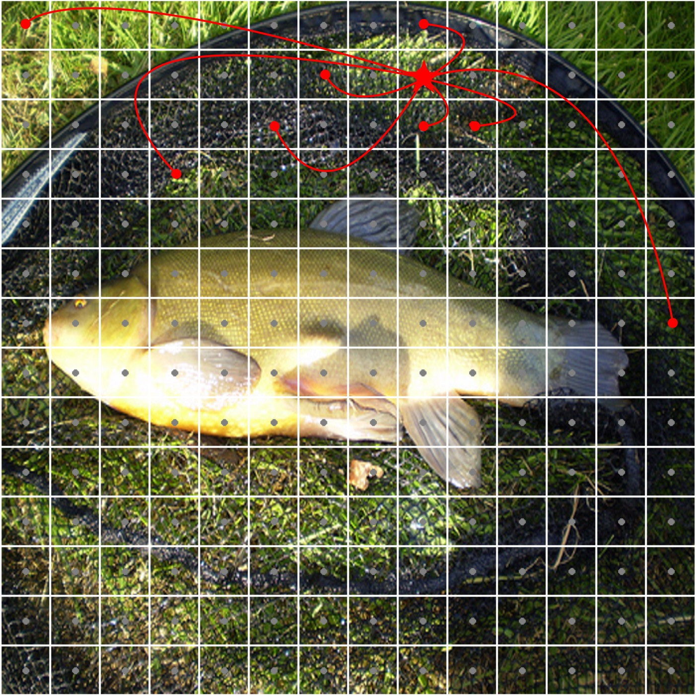
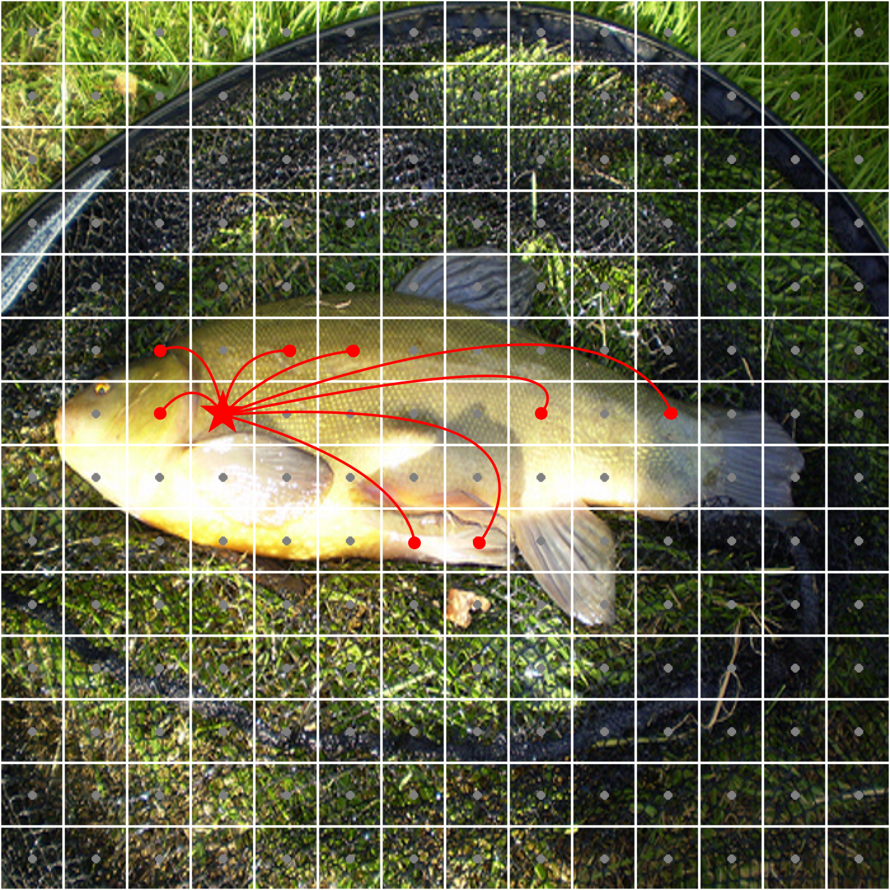

# Hierarchical Convolution and Graph Net for Utilizing Structural Information of Image
<div align="center">
  
  
  <p>
    <span><strong>English</strong></span> | <a href="./README_CN.md">中文</a>
  </p>
</div>

## Introduction

This repository contains the official implementation of our paper:

**Hierarchical Convolution and Graph Net for Utilizing Structural Information of Image**
 Z. Li, D. Dai and T. Yi
 *2024 7th International Conference on Data Science and Information Technology (DSIT), Nanjing, China, 2024, pp. 1-7*
 [IEEE Xplore](https://ieeexplore.ieee.org/abstract/document/10880864) | DOI: 10.1109/DSIT61374.2024.10880864
 
## Create conda environment
```bash
conda env create -f ./env_gcnet.yml  
```
```bash
conda activate gcnet
```

## Pretrained models
- GraphConvNet

| Model            | Params (M) | FLOPs (B) | Top-1 | BaiduDisk URL                                                |
|------------------|------------|-----------|-------| ------------------------------------------------------------ |
| GraphConvNet-Ti  | 7.7        | 1.3       | 77.1  | [BaiduDisk URL](https://pan.baidu.com/s/1_yCwQnPhneGnho6AaT-cBw?pwd=5eri) |
| GraphConvNet-S   | 24.5       | 4.9       | 82.0  | [BaiduDisk URL](https://pan.baidu.com/s/1EBXv987qj9p5X5_OtCOcDA?pwd=hji9) |


- Pyramid GraphConvNet

| Model                   | Params (M) | FLOPs (B) | Top-1 | BaiduDisk URL                                                             |
|-------------------------|------------|-----------|-------|---------------------------------------------------------------------------|
| Pyramid GraphConvNet-Ti | 11.4       | 1.8       | 80.5  | [BaiduDisk URL](https://pan.baidu.com/s/1nYOAoe8R3jf4KMjIWw-KAA?pwd=tmsb) |
| Pyramid GraphConvNet-S  | 29.2       | 4.9       | 82.4  | [BaiduDisk URL](https://pan.baidu.com/s/1KJnmqEmqiw17zV64qqNQRw?pwd=tvkv) |


## Train & Evaluation
**Change parameters** in  `run.sh`   and then run<br> 

```bash
source run.sh
```

## Visualization
The visualization code only available to GraphConvNet and ViG

1. Create a folder named 'ckpt' in './viz_nodes' and download the checkpoints of GraphConvNet-Ti or GraphConvNet-S and put them in './viz_nodes/ckpt'
2. Open `viz_demo.ipnb`, and set arguments (arch, etc.)
3. Run cells

⚠️⚠️⚠️ If you want to visualize ViG, please download the checkpoints I provide [here](https://pan.baidu.com/s/1At2NY9wuAC3MH8hqEICRRg?pwd=3qbz), since I reorganized ViG code and transformed the official checkpoints' state_dict to suit my code.

### Demo:
The first row: gradcam heatmaps of GraphConvNet-Ti in 4th, 8th, 12th layers.<br>
The second row: the patch(node) that has the max gradcam value(most discriminative) and its corresponding neighbors in different layers.<br>
The third row: add edges, the pentagram is the most discriminative node.(you can draw edges using tools such as PowerPoint, OmniGraffle..)

<br>

#### CAM Images:

<div align="center">
  <table>
    <tr>
      <td align="center" width="33%"><strong>4th Layer</strong></td>
      <td align="center" width="33%"><strong>8th Layer</strong></td>
      <td align="center" width="33%"><strong>12th Layer</strong></td>
    </tr>
    <tr>
      <td align="center"></td>
      <td align="center"></td>
      <td align="center"></td>
    </tr>
  </table>
</div>

<br>

#### Center & Neighbors:

<div align="center">
  <table>
    <tr>
      <td align="center" width="33%"><strong>4th Layer</strong></td>
      <td align="center" width="33%"><strong>8th Layer</strong></td>
      <td align="center" width="33%"><strong>12th Layer</strong></td>
    </tr>
    <tr>
      <td align="center"></td>
      <td align="center"></td>
      <td align="center"></td>
    </tr>
  </table>
</div>

<br>

#### Graph Visualization:

<div align="center">
  <table>
    <tr>
      <td align="center" width="33%"><strong>4th Layer</strong></td>
      <td align="center" width="33%"><strong>8th Layer</strong></td>
      <td align="center" width="33%"><strong>12th Layer</strong></td>
    </tr>
    <tr>
      <td align="center"></td>
      <td align="center"></td>
      <td align="center"></td>
    </tr>
  </table>
</div>
## Citation

If you find this work useful for your research, please cite our paper:

```<BIBTEX>
@INPROCEEDINGS{10880864,
  author={Li, Zixuan and Dai, Donghai and Yi, Tieliang},
  booktitle={2024 7th International Conference on Data Science and Information Technology (DSIT)}, 
  title={Hierarchical Convolution and Graph Net for Utilizing Structural Information of Image}, 
  year={2024},
  pages={1-7},
  doi={10.1109/DSIT61374.2024.10880864}
}
``` 
## Acknowledgement

This repo partially uses code from [vig](https://github.com/huawei-noah/Efficient-AI-Backbones/tree/master/vig_pytorch)
