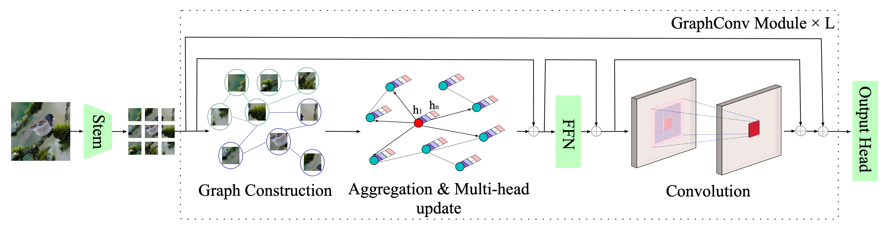
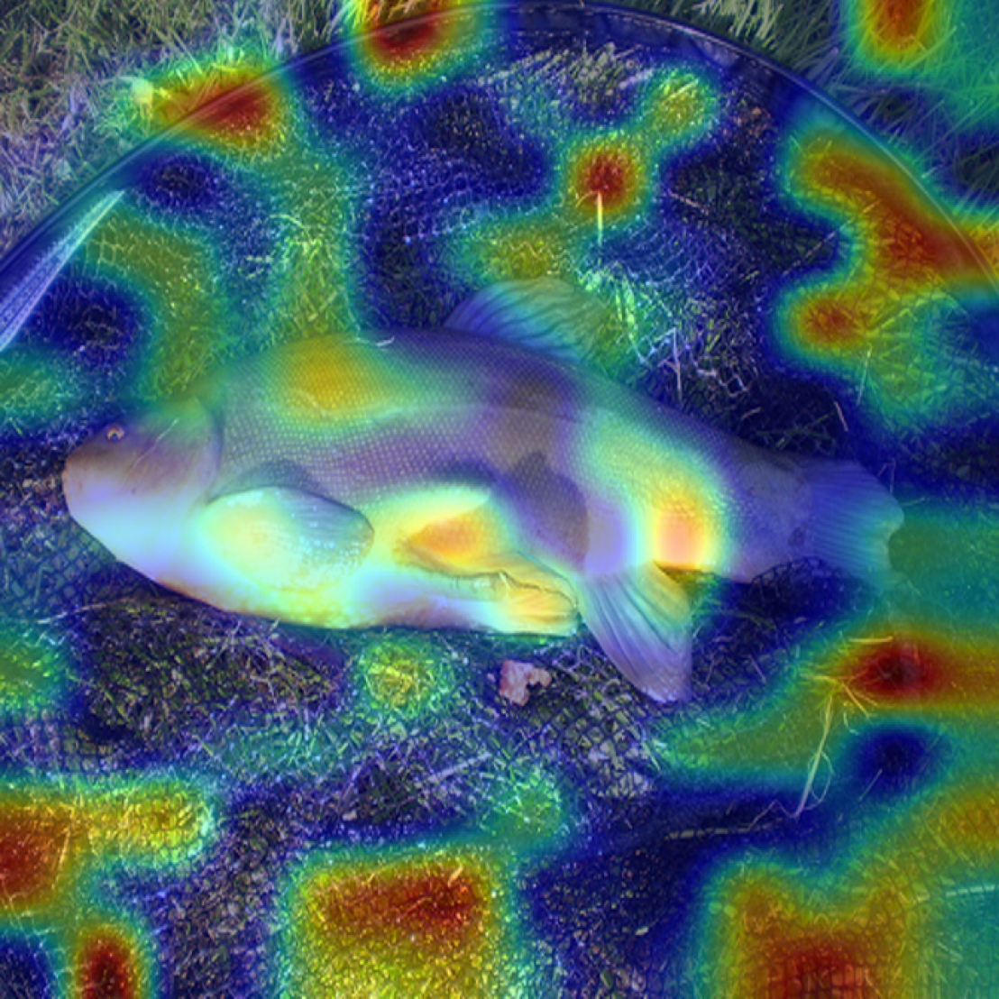
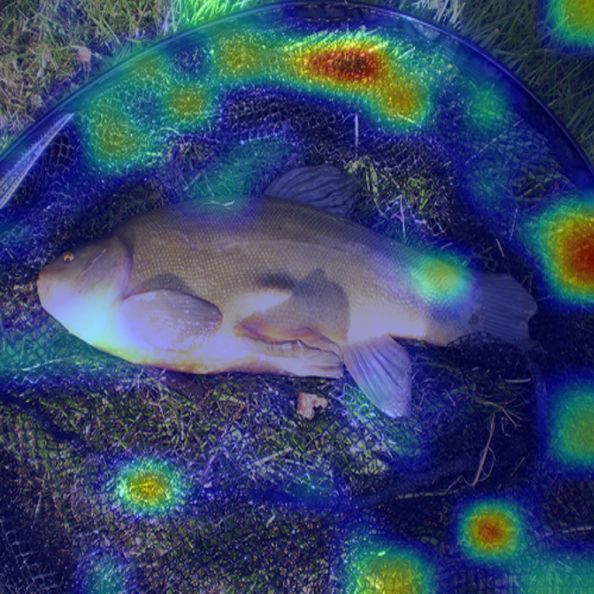
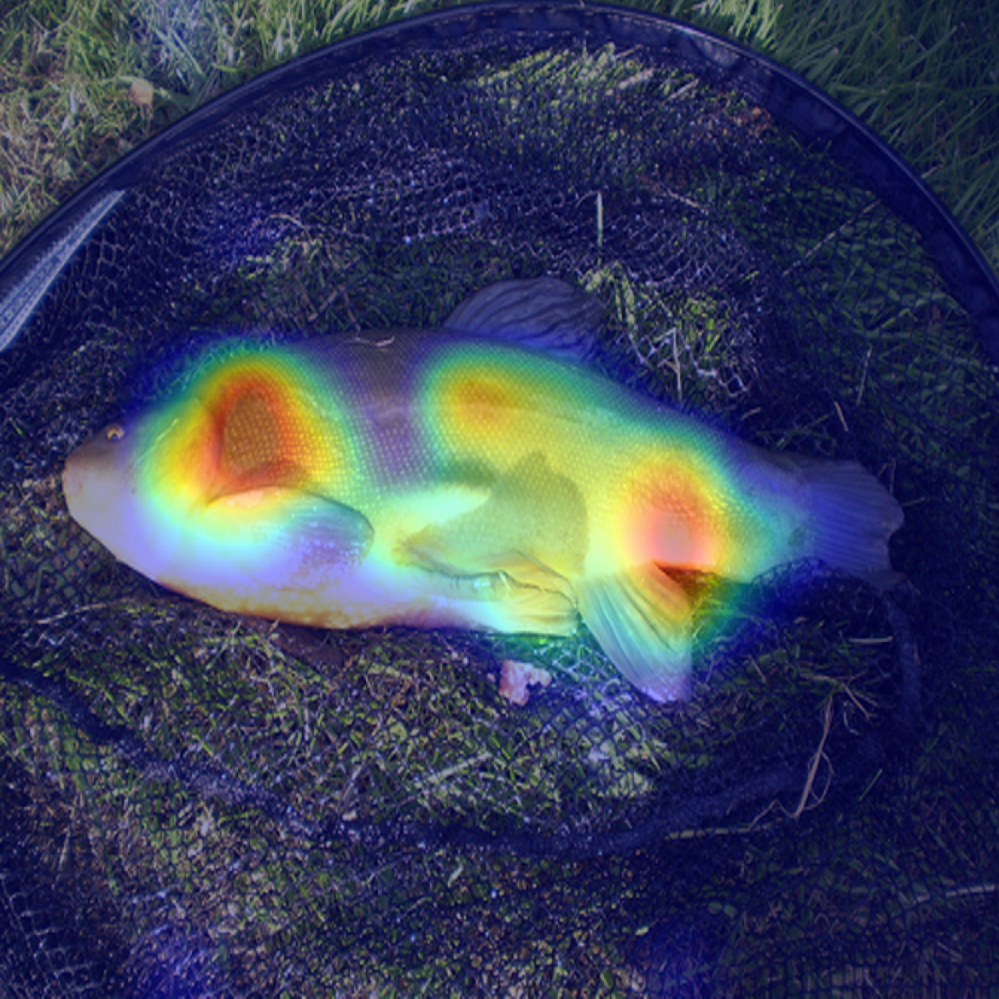
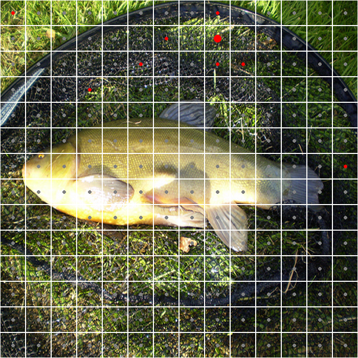
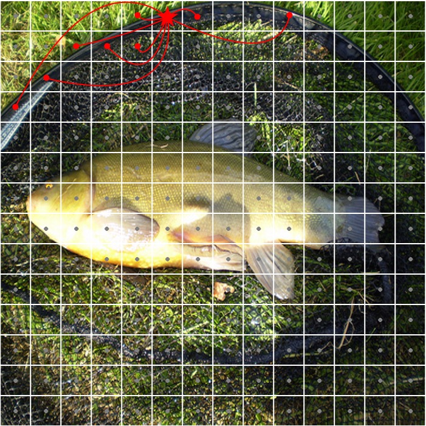
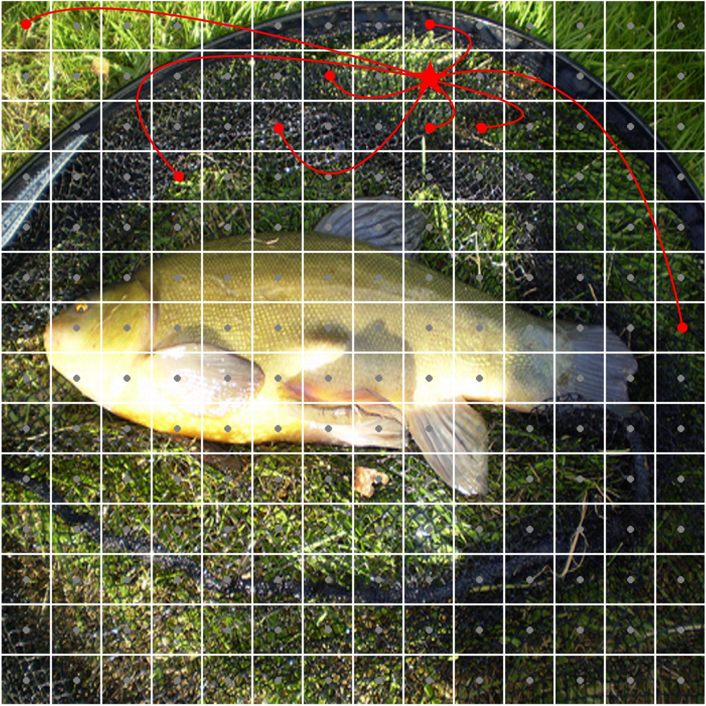
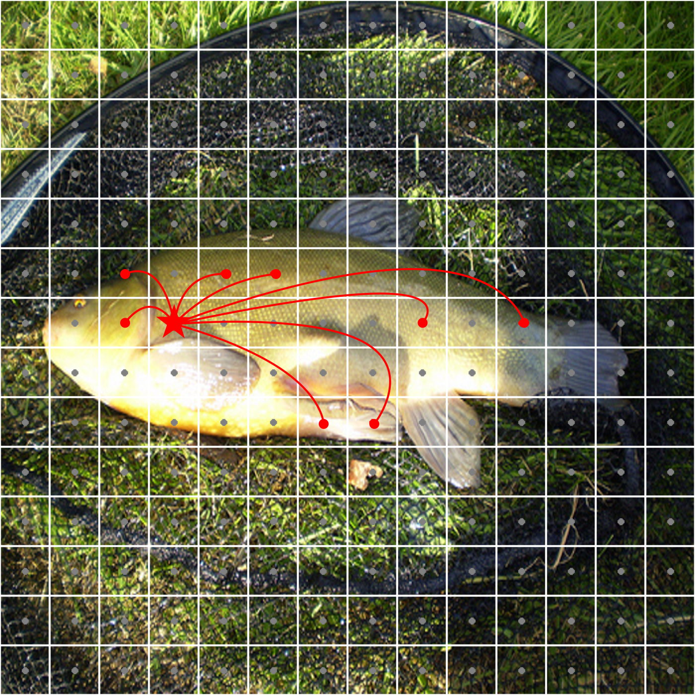

# Hierarchical Convolution and Graph Net for Utilizing Structural Information of Image
<div align="center">
  
  
  <p>
    <a href="README.md">English</a> | <span><strong>中文</strong></span>
  </p>
</div>

## 介绍

这个仓库包含了我们论文的官方实现：

**Hierarchical Convolution and Graph Net for Utilizing Structural Information of Image**
 Z. Li, D. Dai and T. Yi
 *2024 7th International Conference on Data Science and Information Technology (DSIT), Nanjing, China, 2024, pp. 1-7*
 [IEEE Xplore](https://ieeexplore.ieee.org/abstract/document/10880864) | DOI: 10.1109/DSIT61374.2024.10880864

## 创建 conda 环境
```bash
conda env create -f ./env_gcnet.yml  
```
```bash
conda activate gcnet
```

## 预训练模型
- GraphConvNet

| 模型             | 参数量 (M) | FLOPs (B) | Top-1 | 百度网盘链接                                                |
|------------------|------------|-----------|-------| ------------------------------------------------------------ |
| GraphConvNet-Ti  | 7.7        | 1.3       | 77.1  | [百度网盘链接](https://pan.baidu.com/s/1_yCwQnPhneGnho6AaT-cBw?pwd=5eri) |
| GraphConvNet-S   | 24.5       | 4.9       | 82.0  | [百度网盘链接](https://pan.baidu.com/s/1EBXv987qj9p5X5_OtCOcDA?pwd=hji9) |


- Pyramid GraphConvNet

| 模型                    | 参数量 (M) | FLOPs (B) | Top-1 | 百度网盘链接                                                             |
|-------------------------|------------|-----------|-------|---------------------------------------------------------------------------|
| Pyramid GraphConvNet-Ti | 11.4       | 1.8       | 80.5  | [百度网盘链接](https://pan.baidu.com/s/1nYOAoe8R3jf4KMjIWw-KAA?pwd=tmsb) |
| Pyramid GraphConvNet-S  | 29.2       | 4.9       | 82.4  | [百度网盘链接](https://pan.baidu.com/s/1KJnmqEmqiw17zV64qqNQRw?pwd=tvkv) |


## 训练与评估
在 `run.sh` 中**修改参数**，然后运行<br> 

```bash
source run.sh
```

## 可视化
可视化代码适用于 GraphConvNet 和 ViG

1. 在 './viz_nodes' 中创建一个名为 'ckpt' 的文件夹，并下载 GraphConvNet-Ti 或 GraphConvNet-S 的检查点文件放入 './viz_nodes/ckpt'
2. 打开 `viz_demo.ipnb`，设置参数（架构等）
3. 运行单元格

⚠️⚠️⚠️ 如果您想可视化 ViG，请下载我在这里提供的[检查点](https://pan.baidu.com/s/1At2NY9wuAC3MH8hqEICRRg?pwd=3qbz)，因为我重新组织了 ViG 代码并转换了官方检查点的 state_dict 以适应我的代码。

### 演示:
第一行：GraphConvNet-Ti 在第 4、8、12 层的 gradcam 热力图。<br>
第二行：具有最大 gradcam 值（最具辨别力）的图像块（节点）及其在不同层中的对应邻居。<br>
第三行：添加边，五角星是最具辨别力的节点。（您可以使用 PowerPoint、OmniGraffle 等工具绘制边）

<br>

#### CAM 图像:

<div align="center">
  <table>
    <tr>
      <td align="center" width="33%"><strong>第 4 层</strong></td>
      <td align="center" width="33%"><strong>第 8 层</strong></td>
      <td align="center" width="33%"><strong>第 12 层</strong></td>
    </tr>
    <tr>
      <td align="center"></td>
      <td align="center"></td>
      <td align="center"></td>
    </tr>
  </table>
</div>

<br>

#### 中心 & 邻居:

<div align="center">
  <table>
    <tr>
      <td align="center" width="33%"><strong>第 4 层</strong></td>
      <td align="center" width="33%"><strong>第 8 层</strong></td>
      <td align="center" width="33%"><strong>第 12 层</strong></td>
    </tr>
    <tr>
      <td align="center"></td>
      <td align="center"></td>
      <td align="center"></td>
    </tr>
  </table>
</div>

<br>

#### 图结构可视化:

<div align="center">
  <table>
    <tr>
      <td align="center" width="33%"><strong>第 4 层</strong></td>
      <td align="center" width="33%"><strong>第 8 层</strong></td>
      <td align="center" width="33%"><strong>第 12 层</strong></td>
    </tr>
    <tr>
      <td align="center"></td>
      <td align="center"></td>
      <td align="center"></td>
    </tr>
  </table>
</div>

## 引用
如果您发现本工作对您的研究有用，请引用我们的论文：
```
@INPROCEEDINGS{10880864,
  author={Li, Zixuan and Dai, Donghai and Yi, Tieliang},
  booktitle={2024 7th International Conference on Data Science and Information Technology (DSIT)}, 
  title={Hierarchical Convolution and Graph Net for Utilizing Structural Information of Image}, 
  year={2024},
  pages={1-7},
  doi={10.1109/DSIT61374.2024.10880864}
}
```
## 致谢
本仓库部分使用了 [vig](https://github.com/huawei-noah/Efficient-AI-Backbones/tree/master/vig_pytorch) 的代码
